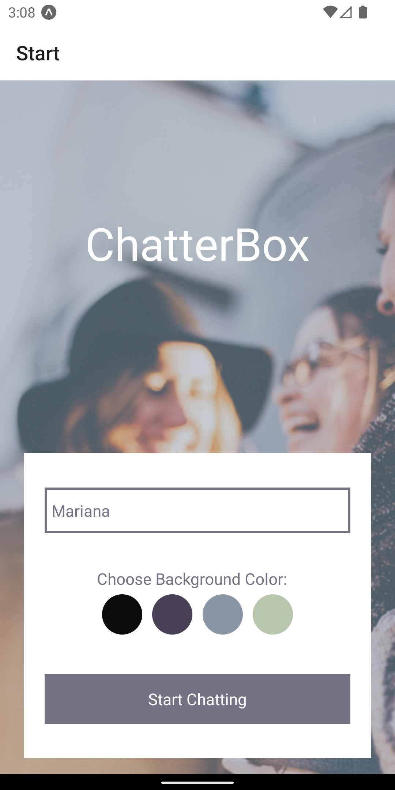
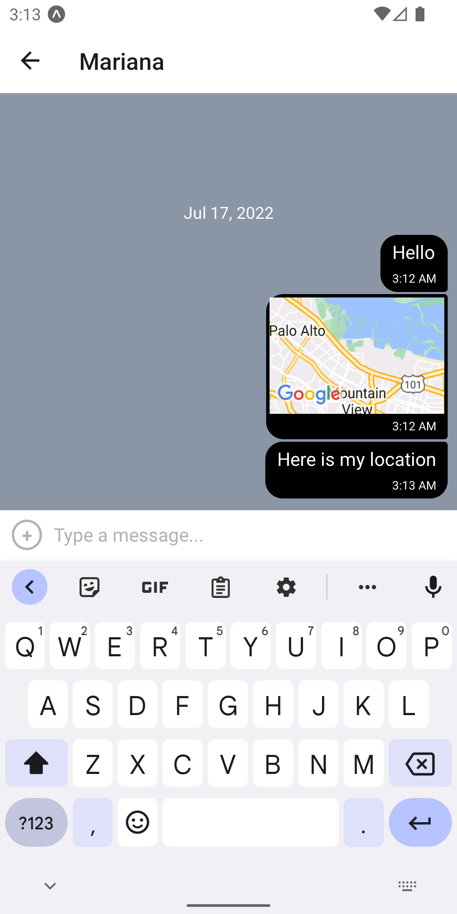

# Chatterbox

## Project Description
A chat app built in React Native for Achievement 5 of the CareerFoundry Full Stack Web Development course.

## Key Features

- Log into a new chatroom, after choosing a name and background color
- Send messages
- Send images
- Share location
- Offline mode (read-only)
- Accessibility features for users with a visual impairment

## Technologies Used

- React-Native
- Expo
- GiftedChat
- NetInfo
- Firebase/Firestore

## Emulators

- XCode
- Expo Go for iOs
- Android Studio

## Screenshot
 

## How to Run

- Install Expo globally
  `npm install -g expo-cli`
- Install dependencies locally
  `npm install`
- Initialise project in Expo
  `expo init 'chat-app'`
- Launch
  `npm run start` or `expo start`
